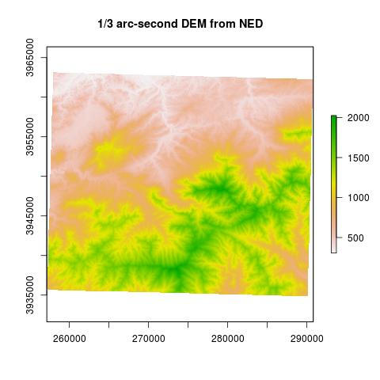

## Question

How do ground truthed elevations compare to L3 DEMs?


## Approach

1. Find out which of the $\approx$ 500 DTMs contain ground truth points

2. Extract nominal DTM elevations to ground truthed values

[https://github.com/mbjoseph/elevation-validation](https://github.com/mbjoseph/elevation-validation)

## Finding extents of each DTM

[R/check_ground_measurements.R](https://github.com/mbjoseph/elevation-validation/blob/master/R/check_ground_measurements.R)

```{r load-helpers, echo=FALSE, message=FALSE, warning=FALSE}
library(dplyr)
library(raster)
library(ggplot2)
library(ggthemes)
library(scales)
source('R/check_ground_measurements.R')
```

```{r}
dtm_dir <- get_dtm_dir()
dtm_files <- find_dtm_files(dtm_dir)
full_dtm_paths <- file.path(dtm_dir, dtm_files)
extents <- lapply(full_dtm_paths, get_extent)
```

## Getting the ground truth data

```{r}
truth <- read.csv('data/GRSM_LiDAR_Val_ITRF00_Geoid12A_UTM17N.csv')
coords <- cbind(truth$Easting, truth$Northing)
sp <- SpatialPoints(coords,
                    proj4string = raster(full_dtm_paths[1]) %>% crs)
spdf <- SpatialPointsDataFrame(sp, truth)
```

## Finding which DTMs contain ground truth data

```{r}
relevant <- lapply(extents,
                   FUN = points_in_extent,
                   x = truth$Easting,
                   y = truth$Northing) %>%
  unlist()

relevant_dtms <- full_dtm_paths[relevant]
```

## Extracting values from relevant DTMs

```{r, warning=FALSE}
spdf$dtm_val <- get_dtm_values(relevant_dtms, spdf)
```

## Visualize congruence

```{r, warning=FALSE, echo = FALSE, fig.width = 6, fig.height = 5}
spdf %>%
  data.frame() %>%
  ggplot(aes(x = Elevation, y = dtm_val)) +
  geom_point(size = 3) +
  geom_abline(intercept = 0, slope = 1) +
  xlab('Ground truth elevation') + 
  ylab('DTM elevation') + 
  theme_excel()
```

## Distribution of errors

```{r, warning = FALSE, echo = FALSE, message=FALSE, fig.width = 6, fig.height = 5}
spdf$diff <- spdf$Elevation - spdf$dtm_val

spdf %>%
  data.frame() %>% 
  ggplot(aes(x = diff)) + 
  geom_histogram(fill = 'yellow', color = 'black') + 
  xlab('Elevation difference: ground truth - DTM') + 
  ylab('Count') + 
  theme_excel()
```

## What information does NEON AOP add to existing our knowledge of elevation?

Specifically...how does the AOP-based DTM compare to the National Elevation Dataset (1/3 arc second resolution)?

## Approach: 

1. Regress NEON elevations on NED elevations. 

2. Summarize bias as the mean of the residuals for each NEON DTM tile.

## Comparison with coarse data




## Comparing NEON DTM to NED

```{r}
ned <- raster('data/GRSM_DEM_USGS_UTM.tif')
plot(ned, main = 'National Elevation Dataset')
```

## Subsetting DTMs (for time)

```{r}
n_to_use <- 50
keep <- sample(length(full_dtm_paths), size = n_to_use)
full_dtm_paths <- full_dtm_paths[keep]
```

## Making comparisons

```{r, echo = FALSE}
r <- raster(full_dtm_paths[1])
pts <- rasterToPoints(r, spatial = TRUE)
ned_vals <- extract(ned, pts, sp = TRUE)
model <- lm(ned_vals@data[, 1] ~ ned_vals@data[, 2])
smoothScatter(ned_vals$GRSM_DEM_USGS_UTM, 
     ned_vals$X2015_GRSM_1_262000_3944000_DTM, 
     nrpoints = 0,
     col = alpha(1, .3), 
     xlab = 'NED elevation', 
     ylab = 'NEON elevation')
abline(model, lty = 1, lwd = 2, col = 3)
abline(0, 1, lwd = 2, lty = 2, col = 2)
legend('topleft', 
       lty = c(2, 1), 
       lwd = 2, 
       col = 2:3, 
       legend = c('1-1 line', 'linear model'), 
       bty = 'n')
```

## Distribution of bias

```{r, echo = FALSE}
res <- readRDS('res.rds')
```

```{r}
br <- 50
hist(res$intercept, breaks = br)
```

## Distribution of slopes

```{r}
hist(res$slope, breaks = br)
```

## Distribution of residual standard deviations

```{r}
hist(res$residual_sd, breaks = br)
```

## Questions
